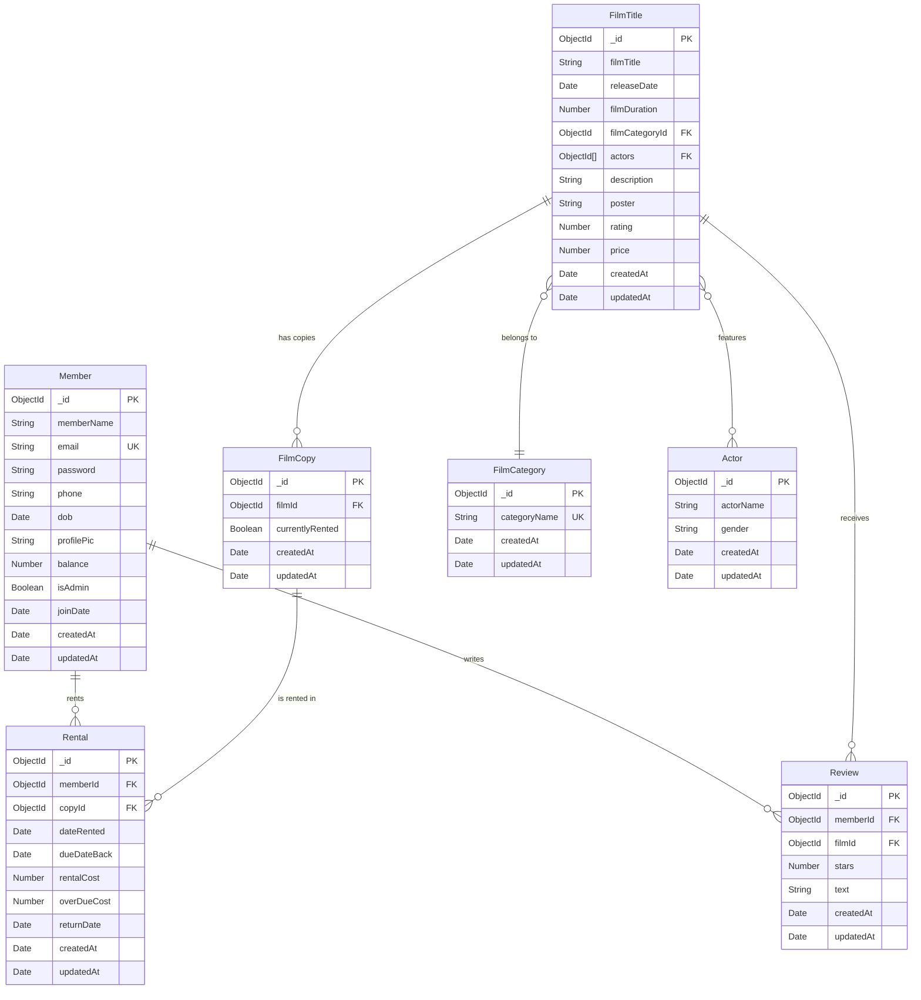

# CineVault Database Schema Documentation

## Overview

CineVault implements MongoDB as its primary database solution, utilizing Mongoose as the Object-Document Mapper (ODM) to enforce schema structure. The database architecture consists of seven relational collections modeling the DVD rental operational domain.

---

## Entity-Relationship Architecture

---

## Collection Specifications

### 1. Members (`members`)

Facilitates the storage of user profiles, authentication credentials, and financial wallet balances.

| Field | Type | Required | Default | Constraints | Description |
|---|---|---|---|---|---|
| `_id` | ObjectId | System | None | Primary Key | Unique identifier |
| `memberName` | String | Yes | None | Trimmed | Full display name |
| `email` | String | Yes | None | Unique, lowercase, trimmed | Login identifier |
| `password` | String | Yes | None | Min 8 chars, hashed (bcrypt) | Omitted from JSON serialization |
| `phone` | String | No | `""` | None | Contact number |
| `dob` | Date | No | None | None | Date of birth |
| `profilePic` | String | No | `""` | None | Base64 encoded string or path |
| `balance` | Number | No | `30` | Minimum 0 | Wallet balance in GBP |
| `isAdmin` | Boolean | No | `false` | None | Privilege escalation flag |
| `joinDate` | Date | No | `Date.now` | None | Registration timestamp |
| `createdAt` | Date | System | None | Mongoose timestamps | Record creation timestamp |
| `updatedAt` | Date | System | None | Mongoose timestamps | Record modification timestamp |

**Implementation Details:**
- Implements a pre-save hook to apply bcrypt hashing (10 salt rounds) on password modifications.
- Implements `matchPassword(entered)` instance method for credential validation.
- Implements customized `toJSON()` transformation to omit password hashes from network responses.

---

### 2. Film Titles (`filmtitles`)

Serves as the central registry for cataloged media.

| Field | Type | Required | Default | Constraints | Description |
|---|---|---|---|---|---|
| `_id` | ObjectId | System | None | Primary Key | Unique identifier |
| `filmTitle` | String | Yes | None | Trimmed | Standardized film nomenclature |
| `releaseDate` | Date | No | None | None | Original theatrical release date |
| `filmDuration` | Number | No | None | None | Runtime duration specified in minutes |
| `filmCategoryId` | ObjectId | No | None | Ref: FilmCategory | Categorical classification link |
| `actors` | ObjectId[] | No | `[]` | Ref: Actor | Associated cast entity links |
| `description` | String | No | `""` | None | Narrative synopsis |
| `poster` | String | No | `""` | None | External or internal resource locator for cover art |
| `rating` | Number | No | `0` | Min 0, Max 5 | Aggregated evaluation score |
| `price` | Number | No | `3.50` | None | Standard transactional cost in GBP |
| `createdAt` | Date | System | None | Mongoose timestamps | Record creation timestamp |
| `updatedAt` | Date | System | None | Mongoose timestamps | Record modification timestamp |

---

### 3. Film Categories (`filmcategories`)

Provides categorical taxonomy for catalog segmentation.

| Field | Type | Required | Default | Constraints | Description |
|---|---|---|---|---|---|
| `_id` | ObjectId | System | None | Primary Key | Unique identifier |
| `categoryName` | String | Yes | None | Unique, trimmed | Formal category nomenclature |
| `createdAt` | Date | System | None | Mongoose timestamps | Record creation timestamp |
| `updatedAt` | Date | System | None | Mongoose timestamps | Record modification timestamp |

---

### 4. Actors (`actors`)

Maintains records of individuals credited within the film catalog.

| Field | Type | Required | Default | Constraints | Description |
|---|---|---|---|---|---|
| `_id` | ObjectId | System | None | Primary Key | Unique identifier |
| `actorName` | String | Yes | None | Trimmed | Full professional name |
| `gender` | String | No | `"M"` | Enum: M, F, O | Demographic identifier |
| `createdAt` | Date | System | None | Mongoose timestamps | Record creation timestamp |
| `updatedAt` | Date | System | None | Mongoose timestamps | Record modification timestamp |

---

### 5. Film Copies (`filmcopies`)

Tracks individual physical assets associated with a specific film title.

| Field | Type | Required | Default | Constraints | Description |
|---|---|---|---|---|---|
| `_id` | ObjectId | System | None | Primary Key | Unique identifier |
| `filmId` | ObjectId | Yes | None | Ref: FilmTitle | Link to parent catalog entry |
| `currentlyRented` | Boolean | No | `false` | None | Inventory availability boolean |
| `createdAt` | Date | System | None | Mongoose timestamps | Record creation timestamp |
| `updatedAt` | Date | System | None | Mongoose timestamps | Record modification timestamp |

---

### 6. Rentals (`rentals`)

Records stateful transaction lifecycles for physical inventory operations.

| Field | Type | Required | Default | Constraints | Description |
|---|---|---|---|---|---|
| `_id` | ObjectId | System | None | Primary Key | Unique identifier |
| `memberId` | ObjectId | Yes | None | Ref: Member | Link to transacting member |
| `copyId` | ObjectId | Yes | None | Ref: FilmCopy | Link to specific physical asset |
| `dateRented` | Date | No | `Date.now` | None | Transaction initiation timestamp |
| `dueDateBack` | Date | Yes | None | None | Established return deadline |
| `rentalCost` | Number | No | `3.50` | None | Financial deduction amount |
| `overDueCost` | Number | No | `0` | None | Calculated penalty fees |
| `returnDate` | Date | No | `null` | None | Asset reception timestamp |
| `createdAt` | Date | System | None | Mongoose timestamps | Record creation timestamp |
| `updatedAt` | Date | System | None | Mongoose timestamps | Record modification timestamp |

---

### 7. Reviews (`reviews`)

Facilitates the storage of qualitative and quantitative user feedback.

| Field | Type | Required | Default | Constraints | Description |
|---|---|---|---|---|---|
| `_id` | ObjectId | System | None | Primary Key | Unique identifier |
| `memberId` | ObjectId | Yes | None | Ref: Member | Link to authoring member |
| `filmId` | ObjectId | Yes | None | Ref: FilmTitle | Link to evaluated catalog entry |
| `stars` | Number | Yes | None | Min 1, Max 5 | Quantitative assessment score |
| `text` | String | No | `""` | Max 500 chars | Qualitative assessment text |
| `createdAt` | Date | System | None | Mongoose timestamps | Record creation timestamp |
| `updatedAt` | Date | System | None | Mongoose timestamps | Record modification timestamp |

**Implementation Details:**
- Implements a compound unique index `{ memberId: 1, filmId: 1 }` to enforce a strict constraint of one review per member per film title.

---

## Relational Architecture Summary

| Relationship | Designation | Context |
|---|---|---|
| Member → Rental | One-to-Many | A member profile encompasses multiple transactional records. |
| Member → Review | One-to-Many | A member profile originates multiple evaluation records. |
| FilmTitle → FilmCopy | One-to-Many | A catalog entry possesses multiple distinct physical assets. |
| FilmTitle → Review | One-to-Many | A catalog entry aggregates multiple evaluation records. |
| FilmTitle → FilmCategory | Many-to-One | A catalog entry is categorized within a single distinct taxonomy node. |
| FilmTitle ↔ Actor | Many-to-Many | Catalog entries reference multiple actors; actors are referenced by multiple entries. |
| FilmCopy → Rental | One-to-Many | A physical asset maintains a historical ledger of multiple transactional operations. |
