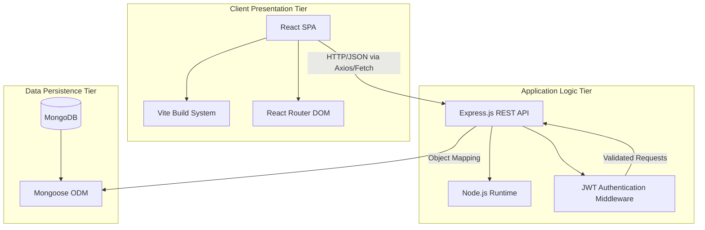

# CineVault Technical Requirements Document (TRD)

## 1. Architecture Overview

CineVault implements a robust, decoupled three-tier architectural pattern.



### Request Lifecycle
1. The client application initiates HTTP/REST requests targeting exposed API endpoints (`/api/*`).
2. Unrestricted routes permit processing without bearer token validation.
3. Restricted routes enforce evaluation via security middleware to validate JWT cryptographic signatures.
4. Administrative routes enforce a secondary evaluation to verify privilege escalation parameters.
5. Controller modules execute core business logic and interface with the persistence layer via Mongoose models.
6. The system serializes responses in standard JSON format.

---

## 2. Infrastructure Specifications

### Environment Parameters

| Component | Specification |
|---|---|
| Execution Environment | Node.js (v18.0.0 or higher) |
| API Framework | Express.js 5.x |
| Build Toolchain | Vite 8.x |
| Persistence Engine | MongoDB 6.x (Local deployment or Atlas cluster) |
| Development Process Manager | Nodemon |

### Environment Variables

| Variable | Definition | Default Value |
|---|---|---|
| `PORT` | API server listener port | `5000` |
| `MONGO_URI` | Standardized database connection string | `mongodb://localhost:27017/cinevault` |
| `JWT_SECRET` | Cryptographic key for token signature generation | *(Mandatory)* |
| `JWT_EXPIRES_IN` | Standard token lifecycle duration | `24h` |
| `NODE_ENV` | Application execution context | `development` |
| `MEMBER_STARTING_BALANCE` | Default digital wallet allocation (GBP) | `30` |

### Network Configuration

| Service Entity | Internal Port Assignment |
|---|---|
| Backend Application Server | 5000 |
| Frontend Development Server | 5173 |
| Database Engine | 27017 |

---

## 3. Dependency Architecture

### Backend Subsystem

| Package | Version | Functional Role |
|---|---|---|
| express | 5.x | Core HTTP routing and middleware framework |
| mongoose | 9.x | Object-Document Mapping and schema validation |
| bcryptjs | 3.x | Cryptographic password hashing |
| jsonwebtoken | 9.x | Session token generation and validation |
| cors | 2.x | Cross-Origin Resource Sharing policy enforcement |
| helmet | 8.x | HTTP security header management |
| morgan | 1.x | Standardized HTTP request logging |
| dotenv | 17.x | Environment variable injection |
| swagger-jsdoc | 6.x | OpenAPI specification generation |
| swagger-ui-express | 5.x | Interactive API documentation hosting |

### Frontend Subsystem

| Package | Version | Functional Role |
|---|---|---|
| react | 19.x | Core interface rendering engine |
| react-dom | 19.x | DOM manipulation layer |
| react-router-dom | 7.x | Client-side routing management |
| formik | 2.x | Form state and lifecycle management |
| yup | 1.x | Object schema validation |
| bootstrap | 5.x | Structural CSS framework |
| vite | 8.x | Asset bundling and development server |

---

## 4. System Directory Structure

```
cinevault-fullstack/
├── docs/                          # Technical documentation repository
├── cinevault-backend/             # Application server logic
│   ├── src/
│   │   ├── config/                # System initialization parameters (DB, OpenAPI)
│   │   ├── controllers/           # Endpoint business logic
│   │   ├── middleware/            # Request interception and validation (Auth, Security)
│   │   ├── models/                # Database schema definitions
│   │   ├── routes/                # Express router configuration
│   │   ├── server.js              # Primary application entry point
│   │   └── seed.js                # Database initialization script
│   ├── .env                       # Environment configuration
│   └── package.json               # Backend dependency manifest
└── cinevault-react/               # Client application
    ├── src/
    │   ├── components/            # Reusable UI interface modules
    │   ├── pages/                 # High-level routing components
    │   ├── context/               # Global state management providers
    │   ├── hooks/                 # Custom React execution hooks
    │   ├── data/                  # Static application constants
    │   ├── App.jsx                # Core application wrapper
    │   ├── main.jsx               # DOM mounting point
    │   └── index.css              # Global styling parameters
    ├── vite.config.js             # Build system configuration
    └── package.json               # Frontend dependency manifest
```

---

## 5. Security Protocols

The application enforces a defense-in-depth approach utilizing several standardized security mechanisms:

| Protocol | Implementation Strategy |
|---|---|
| Cryptographic Hashing | Passwords processed via `bcryptjs` utilizing a computational cost factor of 10 salt rounds. |
| Authorization Architecture | Stateless session management executed via JSON Web Tokens (JWT) transmitted via HTTP Authorization headers. |
| Privilege Escalation Control | Middleware intercepts requests to designated endpoints, verifying the boolean `isAdmin` flag on the requester's data object. |
| HTTP Transport Security | Implementation of `helmet` to inject mandatory security headers (Content-Security-Policy, Strict-Transport-Security, X-Frame-Options). |
| Resource Access Policy | `cors` middleware explicitly configured to manage inter-origin resource requests. |
| Data Integrity Validation | Bi-directional validation via client-side schema checks (Yup) and server-side model constraints (Mongoose). |
| Configuration Secrecy | Utilization of `dotenv` to isolate sensitive parameters from source control repositories. |
